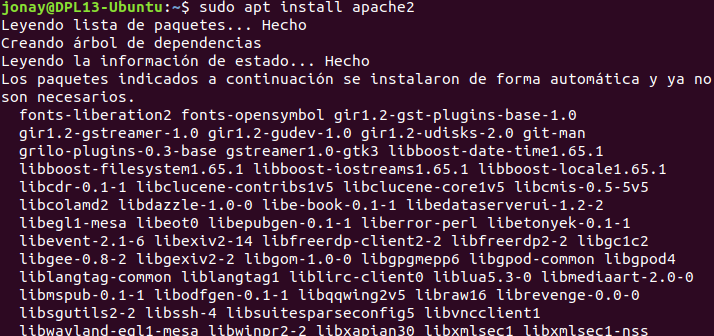
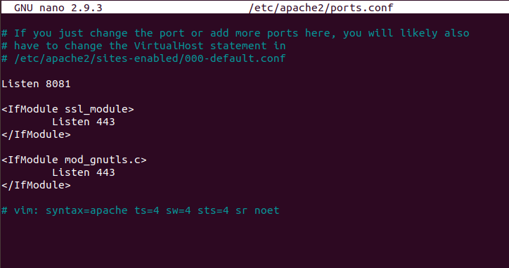
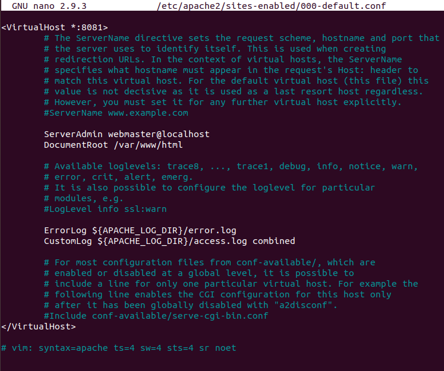
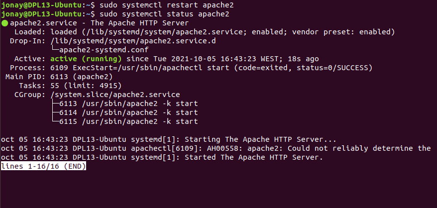
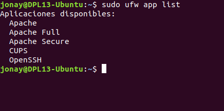
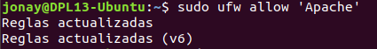
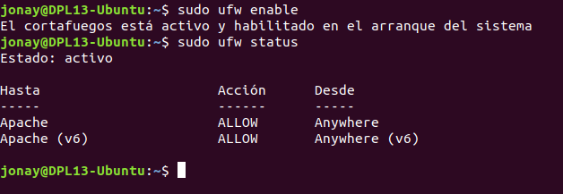
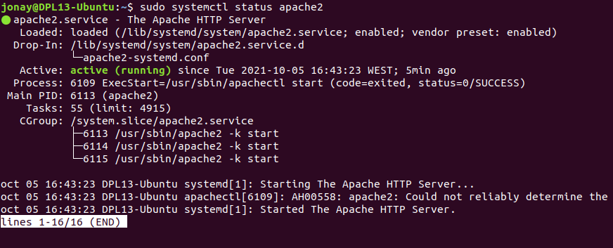
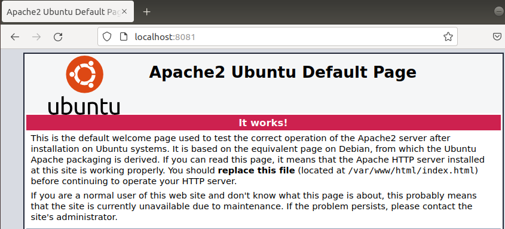

# 1. Instalación de Apache.
En esta tarea vamos a realizar la instalación del servidor Apache, en este caso vamos a instalar el servidor web en una maquina con Ubuntu 20.04.

Primero de todo vamos a actualizar los repositorio y el sistema con el comando siguiente.
```
sudo apt update && sudo apt upgrade
```

Con esto realizado vamos a instalar apache por linea de comando con apt.
```
sudo apt install apache2
```




# 2. Cambio de puertos y cortafuegos.

En alguna caso podemos encontrarnos con un error al final de la instalación de Apache, que nos dirá que no se ha podido realizar  el inicio del servicio. Este error esta puede estar relacionado con que tenemos el puerto 80 usado por otra aplicación en nuestro caso por GitLab.

Error al instalar Apache.


Para poder solucio0nar este problema debemos ir al fichero “//etc/apache2/ports.conf” y cambiar la linea siguiente por el puerto que queramos usar.
```
Listen 80
```

Veamos un ejemplo del fichero que en este caso lo hemos modificado del 80 al 8081.




Seguido también tendremos que modificar el fichero “/etc/apache2/sites-enabled/000-default.conf” para cambiar la siguiente linea.
```
<VirtualHost: *:80>
```




Al terminar los pasos descritos deberemos reiniciar el servicio de apache.




Con el puerto ya añadido vamos a ajustar la configuración del Cortafuegos que en el caso de Ubuntu usa por defecto UFW(Uncomplicated Firewall). 

Para ver los perfiles para Apache en UFW realizamos el siguiente en comando.
```
sudo ufw app list
```




Vamos a permitir el perfil ‘Apache’ en el cortafuego.
```
sudo ufw allow 'Apache'
```




Luego activamos el cortafuegos.
```
sudo ufw enable
```

Y luego vemos el estado
```
sudo ufw status
```



# 3. Comprobación.
Para comprobar que todo esta correcto con la instalación vemos  el “status” del Apache para comprobar si todos esta correcto.

 


Para comprobarlos vamos a acceder a la IP de nuestro equipo seguido del puerto que le hemos asignado a Apache.



