# 1. Instalación Apache-Tomcat.
Vamos a instalar Apache-Tomcat 10 en Linux, concretamente en una maquina con Ubuntu 20.04. Tomcat es un contener Web en el que podemos desplegar aplicaciones en java, otras herramientas o parecidas a este son Jboss o JonAS.

## 1.1 Actualizar Repositorios.
Antes de nada es recomendable actualizar tanto la maquina como los repositorios. Para ellos vamos a usar el siguiente comando.
```
sudo apt update && sudo apt upgrada
```

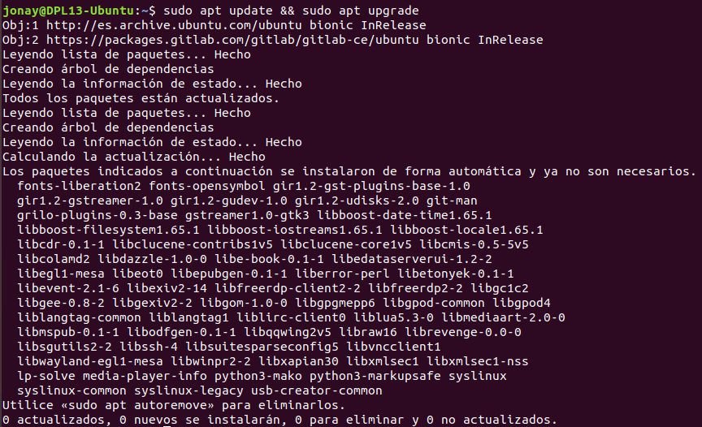


1.2 Instalación Apache-Tomcat.

Ahora con el sistema actualizado vamos a proceder a instalar Tomcat 10. Primero vamos a la pagina oficial y copiamos el enlace de la versión que queremos, lo mejor es coger la versión .tar.gz .
Con el enlace usamos wget para descargarlo.
```
wget https://downloads.apache.org/tomcat/tomcat-10/v10.0.12/bin/apache-tomcat-10.0.12.tar.gz
```

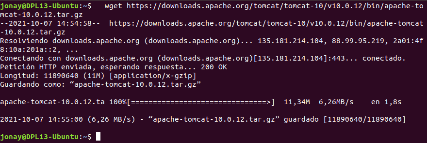

Vamos a prepara la maquina para usar la plataforma como un servicio en el sistema utilizando su porpio usuario y grupo. Para esto realizamos los siguiente pasos.

Primero creamos un nuevo usuario:
```
sudo useradd -U -m -d /opt/tomcat -k /dev/null -s /bin/false tomcat
```

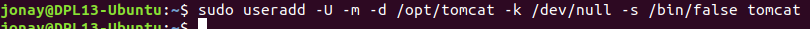

Descomprimimos el paquete que descargamos antes con wget.
```
sudo tar xf apache-tomcat-10.0.12.tar.gz -C /opt/tomcat/
```

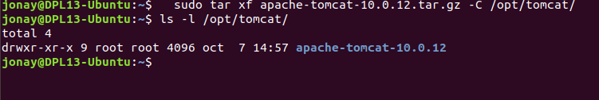

Asignamos como propietarios al usuario Tomcat que hemos creado anteriormente.
```
sudo chown -R tomcat: /opt/tomcat/
```

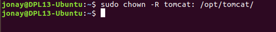


Ahora vamos a crear un enlace simbólico al directorio de instalación para facilitarnos su instalación y configuración.
```
sudo ln -s /opt/tomcat/apache-tomcat-10.0.12/ /opt/tomcat/apache-tomcat
```

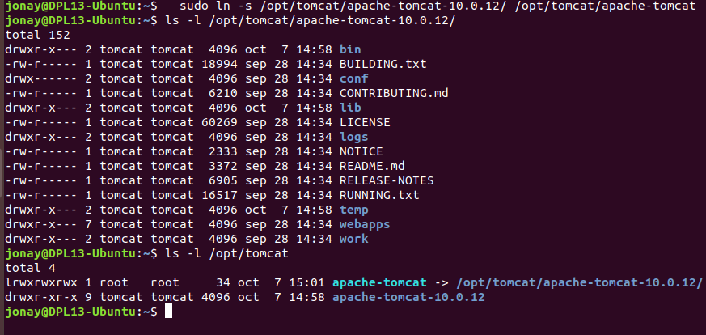


Vamos a configurar el fichero “tomcat10.service” para poder lanzar Tomcat 10 como servicio de Ubuntu. Para ello modificamos el fichero con la siguiente información.
```
sudo nano /etc/systemd/system/tomcat10.service
```

```
[Unit]
Description=Tomcat 10.0 servlet container para Ubuntu 20.04 LTS
After=network.target
[Service]
Type=forking
User=tomcat
Group=tomcat
Environment="JAVA_OPTS=-Djava.security.egd=file:///dev/urandom"
Environment="CATALINA_BASE=/opt/tomcat/apache-tomcat"
Environment="CATALINA_HOME=/opt/tomcat/apache-tomcat"
Environment="CATALINA_PID=/opt/tomcat/apache-tomcat/temp/tomcat.pid"
Environment="CATALINA_OPTS=-Xms512M -Xmx1024M -server -XX:+UseParallelGC"
ExecStart=/opt/tomcat/apache-tomcat/bin/startup.sh
ExecStop=/opt/tomcat/apache-tomcat/bin/shutdown.sh
[Install]
WantedBy=multi-user.target
```


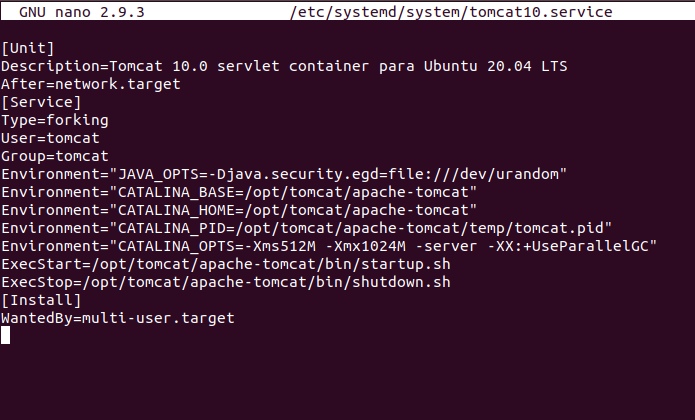

Con esto realizado iniciamos el servicio.
```
sudo systemctl start tomcat10
```

Verificamos el estado del servicio.
```
systemctl status tomcat10
```

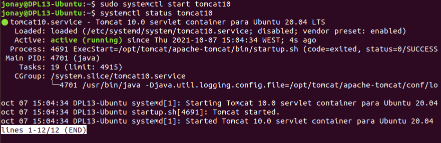


Y habilitamos el inicio automático del servicio.
```
sudo systemctl enable tomcat10
```


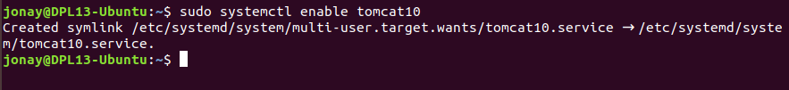


1.3 Acceso a Apache-Tomcat.
Para poder acceder a nuestro Tomcat lo podemos realizar desde un navegador web indicando la ip del servidor y el puerto de conexión. Por defecto debería ser el 8080, pero si ya tenemos otras aplicaciones que ya usan esos puertos debemos realizar la configuración para cambiar el puerto de Tomcat.

Para cambia el puerto de acceso en Apache-Tomcat vamos al fichero “server.xml” y cambiamos el puerto en las siguientes lineas.
```
<Connector port="8080"       //Change this
            protocol="HTTP/1.1"
            connectionTimeout="20000"
            redirectPort="8443"
/>
```
Buscamos el fichero

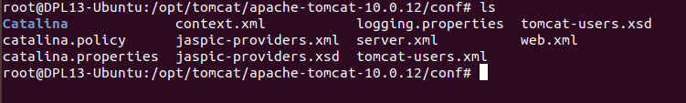

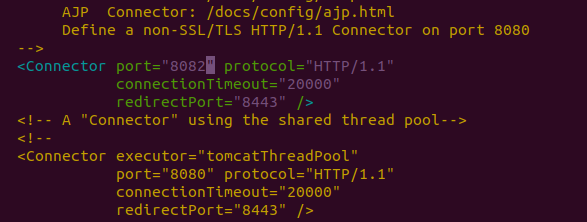


Reiniciamos el servicio.

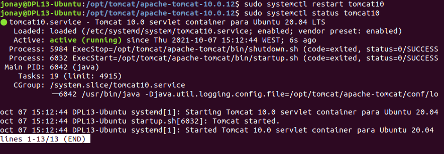

Y al acceder debería quedar algo como esto

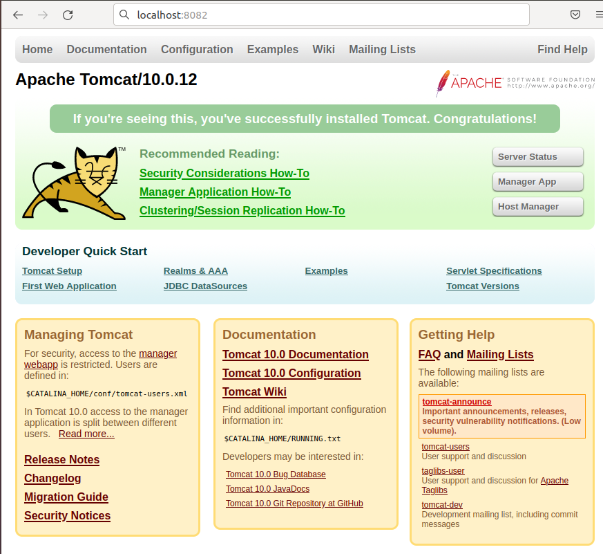