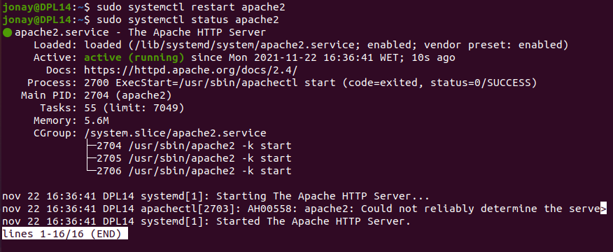
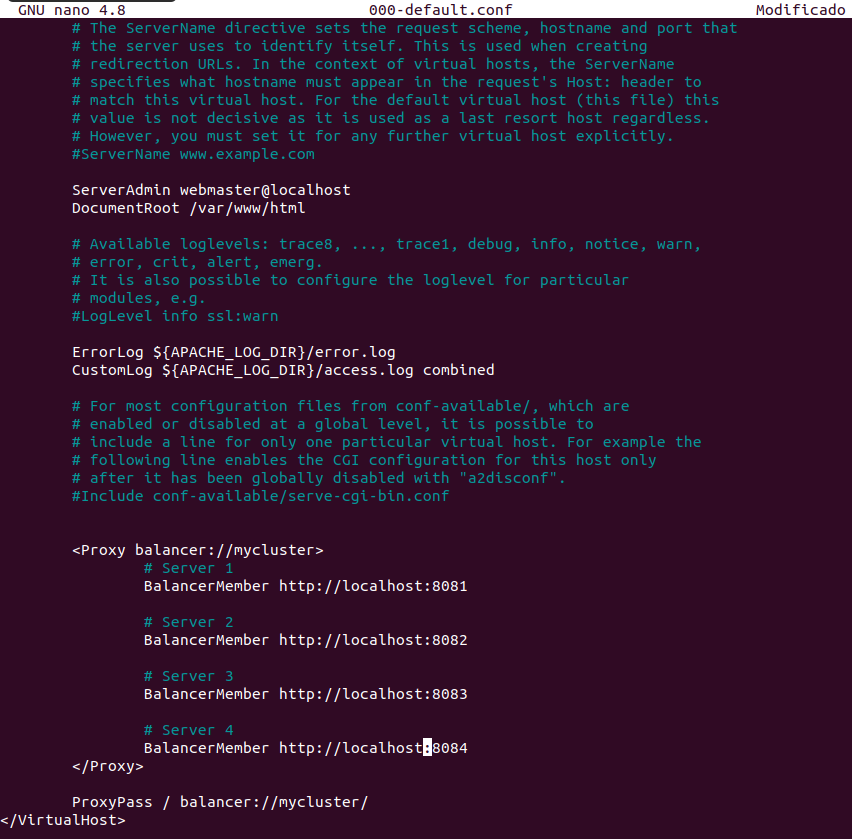
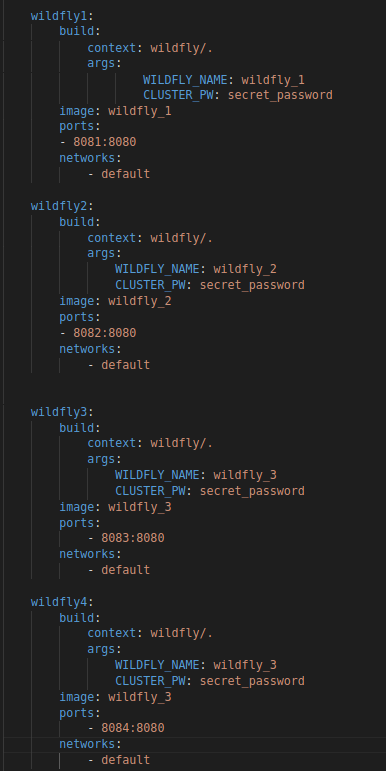
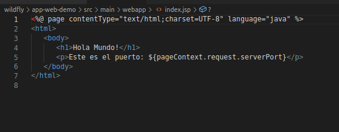

# Balanceo de carga en Apache


## 1. Introducción.
Aparte de poder usar apache como servidor Web, también podemos usar con otras características, como proxy inverso, la que vamos a explicar en esta guía.

## 2. Activar módulos.
Primero vamos a configurar apache para que permita usarse como proxy inverso, para ello vamos a instalar una serie de módulos en Apache. Los módulos son:
```
sudo a2enmod proxy proxy_http proxy_ajp rewrite deflate headers proxy_balancer proxy_connect proxy_html lbmethod_byrequests
```


Con esto realizado, vamos a reiniciar el apache.
```
sudo systemctl restart apache2
```




Ahora vamos a configurar el apache como balanceador de carga, para esto vamos fichero 000-default.conf en el directorio /etc/apache2/sites-available y añadimos las siguientes lineas.
```
<VirtualHost *:80>
  # Dejamos la configuración del VirtualHost como estaba
  # sólo hay que añadir las siguiente directivas: Proxy y ProxyPass

  <Proxy balancer://mycluster>
      # Server 1
      BalancerMember http://IP-HTTP-SERVER-1:8081

      # Server 2
      BalancerMember http://IP-HTTP-SERVER-2:8082

      # Server 3
      BalancerMember http://IP-HTTP-SERVER-3:8083

      # Server 4
      BalancerMember http://IP-HTTP-SERVER-4:8084
  </Proxy>

  ProxyPass / balancer://mycluster/
</VirtualHost>
```
Donde IP-HTTP-SERVER corresponde con el nombre o ip de nuestro servidor.




Y tras esto volvemos a reiniciar apache.


## 3. Lanzar entorno.
Con lo que hemos realizado ya tenemos el servidor apache configurado para realizar un balanceo de carga con los puertos 8081,8082,8083,8084. Ahora necesitamos 4 jboss en los puertos. Para ello vamos a crear los contenedores con docker de los 4 wildfly con la aplicación.




Aplicación web básica con un index.jsp que muestra el puerto.




Estructura del proyecto con el fichero docker-compose. La configuración de WildFly es la que hemos usado en practicas anteriores.


Con esto vamos a levantar el entrono.


Ahora si accedemos al localhost seguido del nombre de la aplicación podremos ver como apache va redireccionado a puertos diferentes cada vez que recargamos la página.


